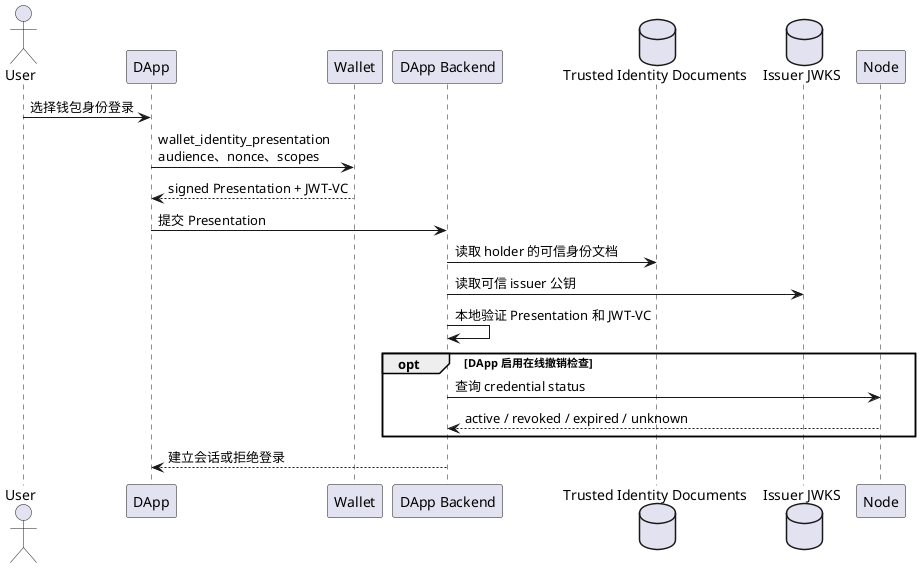
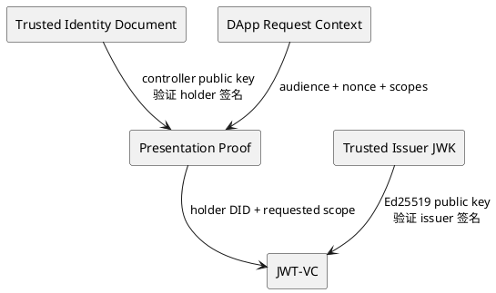
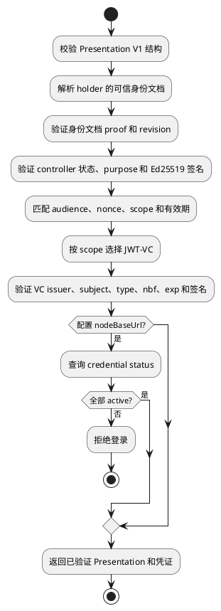
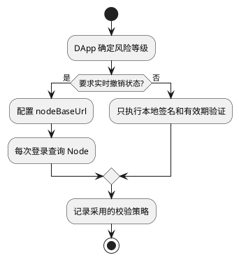

# Presentation 服务端验证

身份出示证明（Presentation）是 Wallet 针对一次登录请求生成并签名的身份声明。DApp 后端本地验证 Presentation 和其中的 JWT-VC；正常登录不需要实时访问 Node。

## 1. 验证边界



各组件的责任：

| 组件 | 责任 |
| --- | --- |
| Wallet | 按请求 scope 选择本地凭证，签名一次性 Presentation |
| DApp 后端 | 管理 audience 和 nonce，验证全部证明，建立应用会话 |
| 信任目录 | 提供 holder 对应的可信身份文档和 issuer 公钥 |
| Node | 签发、续签凭证；在启用在线策略时返回凭证状态 |

需要证明 Ethereum 地址控制权时，DApp 另行执行 SIWE。Presentation 验证不会自动执行 SIWE。

## 2. 信任关系



DApp 后端必须从以下两种来源之一取得可信身份文档：

- `trustedIdentityDocument`
- `resolveIdentityDocument(holder)`

Presentation 必须包含内嵌身份文档，但不得把其中的 controller 公钥直接作为信任来源。校验器会取得独立的可信身份文档，并要求两份文档完全一致。没有可信文档来源时返回：

```text
IDENTITY_DOCUMENT_TRUST_REQUIRED
```

JWT-VC 的 issuer 和公钥由 DApp 的信任配置确定。Presentation 提供的 issuer 信息不能自行建立信任。

## 3. 验证流水线

组合入口 `verifyIdentityPresentationCredentials()` 按固定顺序执行验证：



Scope 和凭证类型的对应关系：

| Scope | 必须验证的凭证 |
| --- | --- |
| `identity.basic` | Presentation holder |
| `identity.wallet` | `WalletAccountCredential`，且 `chainKey/address` 必须与 `walletProof` 一致 |
| `identity.username` | `UsernameCredential` |
| `identity.email` | `EmailCredential` |
| `identity.avatar` | `AvatarCredential` |

请求的 scope 缺少对应凭证时，验证失败；不得删除缺失 scope 后继续登录。

`WalletAccountCredential` 证明 Node 已验证该 Wallet Identity DID 和钱包地址的关联。它不证明用户此刻仍控制地址；需要当前地址控制权时必须另行执行 SIWE。

## 4. 组合验证

```ts
import { verifyIdentityPresentationCredentials } from '@yeying-community/web3-bs'

const verified = await verifyIdentityPresentationCredentials(presentation, {
  expectedAudience: 'https://app.example.com',
  expectedNonce: challenge.nonce,
  expectedScopes: ['identity.email', 'identity.avatar'],
  resolveIdentityDocument,
  issuer: 'did:web:node.example',
  publicJwk: issuerJwk
})
```

该调用完全在 DApp 后端本地完成，不访问 Node。

启用在线凭证状态校验时增加 `nodeBaseUrl`：

```ts
const verified = await verifyIdentityPresentationCredentials(presentation, {
  expectedAudience: 'https://app.example.com',
  expectedNonce: challenge.nonce,
  expectedScopes: ['identity.email', 'identity.avatar'],
  resolveIdentityDocument,
  issuer: 'did:web:node.example',
  publicJwk: issuerJwk,
  nodeBaseUrl: 'https://node.example'
})
```

配置 `nodeBaseUrl` 后，状态查询失败或任一凭证不是 `active` 都会关闭登录流程。

## 5. 分步验证

需要自行编排验证策略时，可以分别验证 JWT-VC 和状态：

```ts
import {
  verifyIdentityCredential,
  queryCredentialStatuses
} from '@yeying-community/web3-bs'

const credential = await verifyIdentityCredential(token, {
  issuer: 'did:web:node.example',
  publicJwk: issuerJwk,
  expectedSubject: walletDid,
  expectedType: 'EmailCredential'
})

const statuses = await queryCredentialStatuses(
  'https://node.example',
  'did:web:node.example',
  [credential.credentialId]
)
```

`verifyIdentityCredential()` 验证 JWT header、issuer、subject、VC type、`nbf`、`exp` 和 Ed25519 签名。`queryCredentialStatuses()` 只查询撤销状态，不能替代前面的密码学验证。

## 6. 状态策略



在线状态查询是 DApp 的撤销策略，不是 Presentation 协议的固定依赖。DApp 必须明确选择本地验证或在线状态验证，不能在 Node 不可用时静默改变策略。

Wallet 在凭证有效时直接使用本地 JWT-VC。账户关联凭证过期或临近过期时，Wallet 通过 Node 的凭证续签流程更新本地凭证；续签属于 Wallet 凭证维护，不属于 DApp 服务端验证流程。

## 7. 失败原则

以下情况必须拒绝登录：

- Presentation 结构、proof、audience、nonce、scope 或有效期错误；
- holder 与可信身份文档不匹配；
- controller 不存在、已停用、purpose 错误或签名无效；
- JWT-VC issuer 不可信、签名无效、已过期或类型不匹配；
- 请求的资料 scope 没有对应凭证；
- 已启用在线状态策略，但查询失败或状态不是 `active`。

`verifyIdentityPresentationCredentials()` 不替 DApp 生成或消费 nonce，不建立应用 session，也不替代 HTTPS、issuer 信任配置和审计记录。
