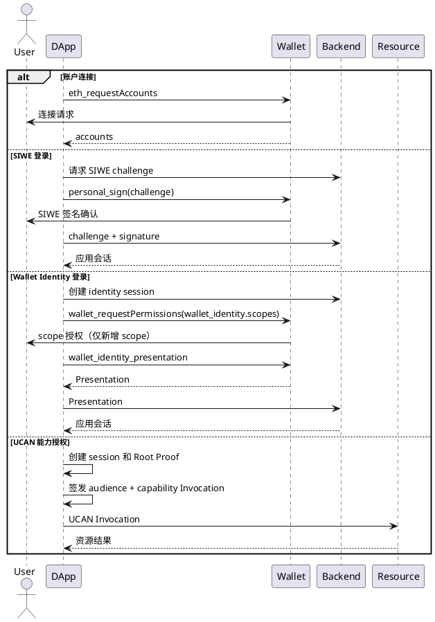

# 登录授权协议选择

web3-bs 提供相互独立的账户连接、登录认证、身份出示和能力授权接口。DApp 按业务目标选择协议，不存在必须依次执行的统一登录流程。

`loginWithChallenge` 已弃用。它在 `1.x` 中仅用于迁移现有自定义签名认证协议，并将在下一个主版本删除。新应用和新增登录流程必须使用 `loginWithSiwe`、`loginWithWalletIdentity` 或应用明确选择的其他标准协议。SDK 不会把 SIWE 请求自动降级为自定义 challenge。

## 1. 协议边界

| 业务目标 | 协议 | SDK 入口 | 是否要求账户 | 结果 |
| --- | --- | --- | --- | --- |
| 读取账户、发起交易 | EIP-1193 | `requestAccounts` | 是 | 钱包地址 |
| 证明 Ethereum 地址控制权 | SIWE | `loginWithSiwe` | 是 | SIWE 签名和应用会话 |
| 使用钱包身份登录 | Wallet Identity | `loginWithWalletIdentity` | 否 | DID、Presentation 和应用会话 |
| 自定义身份出示流程 | Wallet Identity | `requestIdentityPresentation` | 否 | Presentation |
| 授权访问具体资源 | UCAN | `createUcanSession`、`createInvocationUcan` | 由 Root Proof 策略决定 | 能力令牌 |
| 无插件身份登录 | Wallet Identity authorization code + PKCE + Passkey | DApp 后端调用 Node 授权接口 | 否 | DID、身份凭证和应用会话 |

这些结果不能互相替代：

- 账户连接不证明当前用户同意登录；
- SIWE 不返回已验证用户名、邮箱或头像；
- Wallet Identity 不授予 `eth_accounts`、交易或签名权限；
- UCAN 表达资源能力，不建立用户身份登录会话；
- Passkey 登录不自动获得链上账户控制权。

## 2. 独立调用流程

Wallet Identity 已授权 scope 的后续 Presentation 不重复显示连接页。每次请求仍必须使用新的 `nonce` 和 Presentation，并由应用后端验证。

## 3. 协议组合

DApp 可以组合协议，但必须分别调用、分别展示、分别验证：

### Wallet Identity 加 SIWE

只有业务同时需要 DID 身份资料和 Ethereum 地址控制权时才组合：

1. 调用 `loginWithWalletIdentity`，验证 Presentation 并建立身份结果；
2. 独立调用 `loginWithSiwe`，验证 EIP-4361 message、nonce 和签名；
3. 应用后端按自己的账户绑定规则关联两个验证结果。

SIWE 失败不触发 Presentation 自动重试，Presentation 失败也不降级成 SIWE 成功。

### 登录加 UCAN

应用先选择 SIWE、Wallet Identity、Passkey 或其他登录方式建立业务会话；需要访问资源时再独立创建 UCAN。资源服务只验证 UCAN proof chain、audience、capability 和有效期，不把应用登录 token 当作 UCAN。

SDK 通过统一的 `createRootUcan` 和 `getOrCreateUcanRoot` 创建 Root。`proof.type` 是必填判别字段；`proof: { type: 'siwe' }` 表示使用 SIWE 作为 Root Proof。SIWE 是一种可选证明策略，不是 UCAN 协议的固定步骤。新增证明策略时扩展 `proof` 联合类型，不增加新的顶层 Root 创建接口。

## 4. 外部钱包兼容

- 标准 EIP-1193 钱包可以使用账户连接和 SIWE。
- 实现 `wallet_identity` 与 `wallet_identity_presentation` 的钱包可以使用 Wallet Identity。
- 不支持 Wallet Identity 的钱包返回 `-32601` 时，DApp 可以向用户提供 SIWE 或其他登录入口，但 SDK 不自动降级。
- UCAN 是否可用由 DApp、钱包和资源服务共同支持的 proof 与签名能力决定。
- DApp 不能要求所有钱包实现 YeYing 扩展后才允许标准账户连接或 SIWE。

## 5. 登出和撤销

- DApp 登出负责撤销自己的服务端会话并清理本地 token。
- 登出不等于撤销钱包账户权限或 Wallet Identity scope。
- `wallet_revokePermissions` 只撤销 Wallet Provider 权限，不自动注销服务端会话。
- UCAN 撤销和过期按资源服务策略处理，不由 SIWE 或 Wallet Identity 登出代替。

## 6. 选择检查表

1. 只需要地址和交易：EIP-1193。
2. 需要证明地址控制权：SIWE。
3. 需要 DID、已验证用户名、邮箱或头像：Wallet Identity。
4. 需要限定资源、动作、服务和有效期：UCAN。
5. 没有插件仍需登录钱包身份：Passkey / WebAuthn。
6. 同时需要多种结果：由 DApp 明确组合，不依赖 SDK 隐式串联。

无插件流程的完整接入契约见[无插件身份登录接入](../身份授权/无插件身份登录接入.md)。

Passkey 是无插件 Wallet Identity 登录使用的认证器，注册和管理见[通行证接入](../身份授权/通行证接入.md)。TOTP 仅用于敏感操作二次确认，不属于登录协议，接入边界见[TOTP 验证接入](../身份授权/TOTP验证接入.md)。
