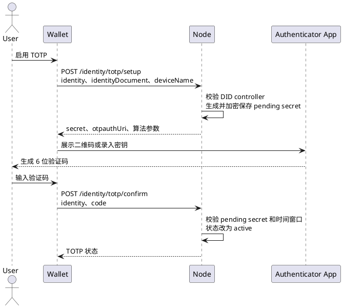
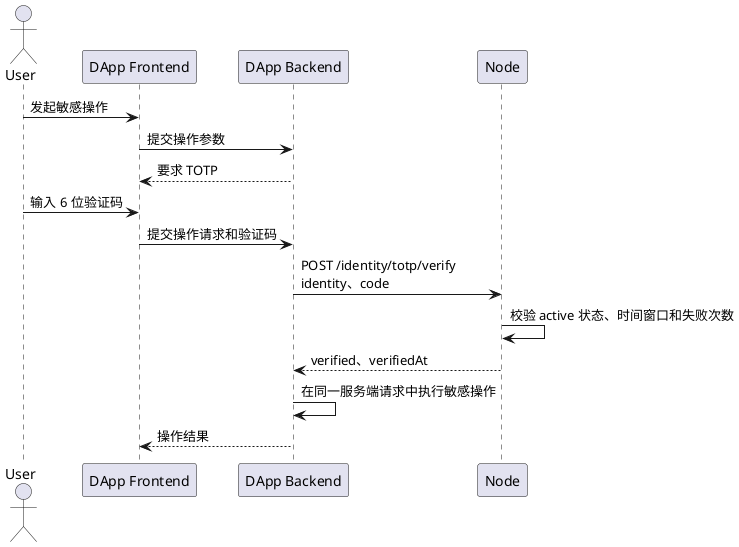

# TOTP 验证接入

TOTP 是绑定到 Wallet Identity DID 的时间型一次性密码认证器，用于敏感操作的二次确认。TOTP 不建立 Wallet Identity 登录会话，不替代 Passkey、SIWE、Wallet Identity presentation 或 UCAN。

当前 Node `verify` 接口返回一次校验结果，不签发带 audience、nonce、操作标识和有效期的证明。因此该结果不能作为跨服务授权令牌，也不能由 DApp 前端直接校验后据此执行敏感操作。

## 1. 接入边界

| 参与方 | 职责 |
| --- | --- |
| Wallet | 启用、确认、查看和撤销 TOTP；只在 setup 阶段接收 secret |
| 认证器应用 | 保存 TOTP secret，每 30 秒生成 6 位验证码 |
| Node | 加密保存 secret，校验验证码，执行失败限流并记录审计日志 |
| DApp 后端 | 在自身敏感操作流程中调用 Node 校验，并决定是否执行该操作 |
| web3-bs | 说明 HTTP 契约；不把 TOTP 包装成 Provider 登录协议 |

Node 当前参数固定为 SHA-1、6 位、30 秒周期，校验窗口为当前时间片前后各一个时间片。单个 DID 的 confirm 和 verify 分别执行 5 分钟最多 10 次的进程内失败限流。

## 2. 启用流程



### 2.1 查询服务状态

```http
GET {nodeBaseUrl}/api/v1/public/identity/totp/status
```

成功响应的 `data` 包含：

```json
{
  "enabled": true,
  "ready": true,
  "issuerName": "YeYing Node",
  "digits": 6,
  "period": 30,
  "algorithm": "SHA1"
}
```

`ready: false` 表示 Node 未配置用于派生 TOTP 存储密钥的运行时密钥，此时不得开始 setup 或 verify。

### 2.2 创建配置

```http
POST {nodeBaseUrl}/api/v1/public/identity/totp/setup
Content-Type: application/json
```

```json
{
  "identity": "did:yeying:wid_...",
  "identityDocument": {},
  "deviceName": "Phone Authenticator"
}
```

成功响应的 `data.totp` 包含 `issuer`、`accountName`、`secret`、`algorithm`、`digits`、`period` 和 `otpauthUri`。明文 `secret` 只在该响应中提供给 Wallet。Wallet 可展示 `otpauthUri` 二维码，但不得把 secret 写入日志、身份文档、DApp 状态或普通备份。

再次 setup 会替换该 DID 的旧配置并生成新的 pending secret。新配置必须经过 confirm 才能用于 verify。

### 2.3 确认配置

```http
POST {nodeBaseUrl}/api/v1/public/identity/totp/confirm
Content-Type: application/json

{"identity":"did:yeying:wid_...","code":"123456"}
```

确认成功后状态从 `pending` 变为 `active`，并返回该 DID 的公开 TOTP 状态。

## 3. 查询身份状态

```http
POST {nodeBaseUrl}/api/v1/public/identity/totp/get
Content-Type: application/json

{"identity":"did:yeying:wid_..."}
```

响应不包含 secret，只包含：

```json
{
  "identity": "did:yeying:wid_...",
  "totp": {
    "enabled": true,
    "status": "active",
    "deviceName": "Phone Authenticator",
    "createdAt": "...",
    "confirmedAt": "...",
    "lastUsedAt": "...",
    "revokedAt": ""
  }
}
```

## 4. 敏感操作验证



校验接口：

```http
POST {nodeBaseUrl}/api/v1/public/identity/totp/verify
Content-Type: application/json

{"identity":"did:yeying:wid_...","code":"123456"}
```

成功响应的 `data`：

```json
{
  "identity": "did:yeying:wid_...",
  "verified": true,
  "verifiedAt": "2026-08-29T14:00:00.000Z"
}
```

DApp 后端必须把 Node 调用和敏感操作放在同一条受控服务端流程中。当前响应没有签名、audience、nonce 或操作 challenge，不能交给另一个服务验证，也不能缓存为一段时间内通用的“已二次验证”状态。

## 5. 撤销

```http
POST {nodeBaseUrl}/api/v1/public/identity/totp/revoke
Content-Type: application/json
```

```json
{
  "identity": "did:yeying:wid_...",
  "identityDocument": {}
}
```

撤销必须校验身份 controller。撤销后状态为 `revoked`，原 secret 立即不能通过 verify。重新启用必须从 setup 开始并生成新 secret。

## 6. 错误处理

| 错误码 | 含义 | 处理方式 | 可重试 |
| --- | --- | --- | --- |
| `IDENTITY_INVALID_DID` | DID 格式错误 | 修正请求 | 否 |
| `IDENTITY_TOTP_NOT_READY` | Node 密钥配置未就绪 | 修复 Node 配置 | 配置完成后 |
| `IDENTITY_TOTP_SETUP_NOT_FOUND` | 没有待确认配置 | 重新 setup | 是 |
| `IDENTITY_TOTP_NOT_ENABLED` | 没有 active TOTP | 引导用户启用 | 否 |
| `IDENTITY_TOTP_CODE_INVALID` | 验证码错误或超出时间窗口 | 请求用户输入当前验证码 | 是 |
| `IDENTITY_TOTP_ATTEMPTS_EXCEEDED` | 5 分钟窗口内尝试超过 10 次 | 等待限流窗口结束 | 是 |
| `IDENTITY_TOTP_SECRET_CORRUPTED` | Node 无法解密已存 secret | 记录服务端故障并重新配置 | 修复后 |

## 7. 验收标准

1. setup 返回的 secret 和 `otpauthUri` 能被标准认证器应用识别。
2. 未 confirm 的配置不能通过 verify。
3. confirm 后当前时间窗口内的验证码通过，错误验证码失败。
4. get、confirm、verify 和 revoke 的响应都不包含明文 secret。
5. revoke 后旧验证码不能继续使用。
6. DApp 不把 `{ verified: true }` 当作登录结果或跨服务授权证明。
