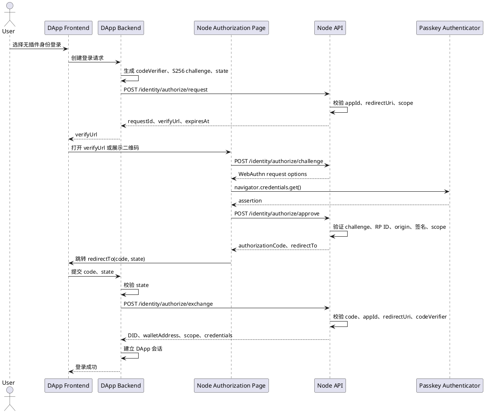

# 无插件身份登录接入

无插件身份登录用于浏览器中没有 Wallet Provider 的场景。用户使用已经绑定到钱包身份的 Passkey 完成认证，DApp 最终获得与插件登录相同的钱包身份 DID 和经过授权的身份凭证。

该流程采用 Wallet Identity authorization code + PKCE S256，不是 SIWE，也不要求 `eth_accounts`。Passkey 是钱包身份认证器，不产生新的身份主体。

## 1. 参与方

| 参与方 | 职责 |
| --- | --- |
| DApp 前端 | 发起登录、打开 `verifyUrl`、处理回调页面 |
| DApp 后端 | 生成 PKCE 和 state、调用 Node、兑换授权码、建立应用会话 |
| Node | 校验应用和 redirect URI、托管授权页、验证 Passkey、签发一次性授权码 |
| Passkey 认证器 | 证明用户控制已经绑定到钱包身份 DID 的认证器 |

`web3-bs` 不封装 Node authorization code 接口。该流程中的 `codeVerifier`、state 和应用会话都属于 DApp 后端安全状态，不应交给 Wallet Provider 或由浏览器 SDK 持久化。

## 2. 前置条件

1. DApp 已在 Node 应用中心发布，并取得 `appId`。
2. 回调地址已完整登记在该应用的 `redirectUris` 中。
3. Node 已配置 HTTPS、WebAuthn `rpId`、`origin` 和公开访问地址。
4. 用户已经为钱包身份 DID 注册至少一个未撤销的 Passkey。
5. DApp 后端能够短期保存 `codeVerifier`、state、redirect URI 和登录发起时间。

Node 对 `redirectUri` 做完整字符串匹配。生产环境不得使用动态拼接或通配回调地址。

## 3. 标准流程



授权请求有效期为 5 分钟，授权码有效期为 60 秒。授权码只能兑换一次。

## 4. 创建授权请求

DApp 后端生成 43 至 128 个 RFC 7636 unreserved 字符组成的 `codeVerifier`：

```text
codeChallenge = BASE64URL_NO_PADDING(SHA256(ASCII(codeVerifier)))
codeChallengeMethod = S256
```

请求：

```http
POST {nodeBaseUrl}/api/v1/public/identity/authorize/request
Content-Type: application/json
```

```json
{
  "appId": "app_project",
  "redirectUri": "https://app.example.com/auth/wallet-identity/callback",
  "state": "random-state-bound-to-browser-session",
  "codeChallenge": "base64url-sha256-code-challenge",
  "codeChallengeMethod": "S256",
  "scopes": [
    "identity.basic",
    "identity.username",
    "identity.email",
    "identity.avatar"
  ]
}
```

成功响应的 `data`：

```json
{
  "requestId": "iar_...",
  "status": "pending",
  "appId": "app_project",
  "appName": "Project",
  "redirectUri": "https://app.example.com/auth/wallet-identity/callback",
  "state": "random-state-bound-to-browser-session",
  "audience": "https://app.example.com",
  "nonce": "nonce_...",
  "scopes": ["identity.basic", "identity.username", "identity.email", "identity.avatar"],
  "expiresAt": "2026-08-29T14:05:00.000Z",
  "verifyUrl": "https://node.example.com/identity/authorize?requestId=iar_...",
  "codeChallengeMethod": "S256"
}
```

DApp 后端保存 `requestId`、`codeVerifier`、state、`appId`、`redirectUri` 和 `expiresAt`。返回前端的内容只需要 `verifyUrl` 和展示所需的过期时间；不得返回 `codeVerifier`。

## 5. 用户确认页面

DApp 可以直接打开 `verifyUrl`，也可以把同一个 URL 编码成二维码供另一设备扫描。Node 授权页显示：

- 应用名称；
- 请求的身份 scope；
- 请求有效状态；
- Passkey 系统确认界面。

Node 授权页依次调用：

```text
POST /api/v1/public/identity/authorize/challenge
POST /api/v1/public/identity/authorize/approve
```

这些调用由 Node 页面完成，DApp 不应自行复制 WebAuthn challenge 和 assertion 转换代码。

Passkey 验证成功后，Node 返回一次性 `authorizationCode` 和 `redirectTo`。授权页跳转到已登记的回调地址：

```text
https://app.example.com/auth/wallet-identity/callback?code=iac_...&state=...
```

通行证的注册、列表、撤销及 WebAuthn 安全边界见[通行证接入](./通行证接入.md)。

## 6. 兑换授权码

DApp 回调处理器必须先使用恒定时间比较校验 state，再由后端兑换授权码：

```http
POST {nodeBaseUrl}/api/v1/public/identity/authorize/exchange
Content-Type: application/json
```

```json
{
  "code": "iac_...",
  "appId": "app_project",
  "redirectUri": "https://app.example.com/auth/wallet-identity/callback",
  "codeVerifier": "original-pkce-code-verifier"
}
```

成功响应的 `data`：

```json
{
  "requestId": "iar_...",
  "appId": "app_project",
  "redirectUri": "https://app.example.com/auth/wallet-identity/callback",
  "state": "random-state-bound-to-browser-session",
  "did": "did:yeying:wid_...",
  "walletAddress": "0x...",
  "scopes": ["identity.basic", "identity.username", "identity.email", "identity.avatar"],
  "issuedAt": "2026-08-29T14:01:00.000Z",
  "credentials": [
    {
      "type": "EmailCredential",
      "credentialId": "...",
      "credential": "compact-JWS-JWT-VC"
    }
  ]
}
```

DApp 使用 `did` 作为本地身份主键。`walletAddress`、用户名、邮箱和头像都是可变的关联信息，不得代替 DID 成为身份主键。

Node exchange 返回身份结果，不直接替 DApp 建立业务会话。DApp 后端验证结果后签发自己的 session cookie 或 access token。

## 7. Scope 规则

| Scope | 返回要求 |
| --- | --- |
| `identity.basic` | 返回钱包身份 DID；Node 自动加入该 scope |
| `identity.wallet` | 身份必须存在有效钱包账户关联；结果包含 `walletAddress` 和 `WalletAccountCredential` |
| `identity.username` | 必须存在有效 `UsernameCredential` |
| `identity.email` | 必须存在有效 `EmailCredential` |
| `identity.avatar` | 必须存在有效 `AvatarCredential` |

请求的资料凭证不存在、已撤销或已过期时，Node 不得静默删除 scope 后继续登录，而是拒绝授权。

## 8. 安全要求

- 只允许 PKCE `S256`，禁止 `plain`。
- `codeVerifier` 只保存在 DApp 后端，兑换完成或请求过期后立即删除。
- state 必须随机生成、绑定发起登录的浏览器会话，并在回调时校验。
- `appId`、`redirectUri` 和 `codeVerifier` 必须与创建授权请求时完全一致。
- 授权码必须一次性使用，重复兑换必须失败。
- DApp 不得信任回调 URL 中除 `code` 和 state 之外的身份字段。
- WebAuthn challenge、RP ID、origin、用户验证状态、签名计数器和凭证撤销状态由 Node 验证。
- DApp 不能把 Passkey credential ID 当作用户身份主键。
- 登录成功只建立 DApp 会话，不授予 `eth_accounts`、交易签名或 UCAN 资源能力。

## 9. 页面流转

同一设备：

```text
DApp 登录页
→ Node 身份授权页
→ 系统 Passkey 确认
→ DApp 回调页
→ DApp 业务页面
```

跨设备扫码：

```text
PC DApp 登录页展示 verifyUrl 二维码
→ 手机打开 Node 身份授权页
→ 手机 Passkey 确认
→ PC 端按 requestId 查询状态或等待应用自己的会话通知
→ DApp 后端兑换授权码并建立会话
```

跨设备流程不能依赖手机浏览器跳回 PC 的回调页面。DApp 必须通过自己的后端状态查询、SSE 或 WebSocket 把登录结果通知 PC 页面。

## 10. 错误处理

| 错误 | 含义 | DApp 处理 |
| --- | --- | --- |
| `IDENTITY_AUTHORIZATION_REQUEST_INVALID` | appId、redirect URI 或 PKCE 请求不完整 | 修正请求，不重试原请求 |
| `IDENTITY_REDIRECT_URI_UNAUTHORIZED` | 回调地址未登记 | 修正 Node 应用配置 |
| `IDENTITY_AUTHORIZATION_REQUEST_EXPIRED` | 授权请求过期或已经处理 | 创建新的授权请求 |
| `IDENTITY_PASSKEY_CREDENTIAL_NOT_FOUND` | 没有可用 Passkey 或凭证已撤销 | 使用 Wallet 登录后重新注册 Passkey |
| `IDENTITY_PASSKEY_CHALLENGE_EXPIRED` | WebAuthn challenge 过期 | 重新获取 challenge |
| `IDENTITY_AUTHORIZATION_CODE_INVALID` | code 无效、过期或已使用 | 重新开始完整登录 |
| `IDENTITY_AUTHORIZATION_CODE_APP_MISMATCH` | appId 或 redirect URI 不匹配 | 终止流程并记录安全事件 |
| `IDENTITY_PKCE_VERIFIER_INVALID` | verifier 格式错误 | 修复 DApp 后端实现 |
| `IDENTITY_PKCE_VERIFICATION_FAILED` | verifier 与 challenge 不匹配 | 终止流程并记录安全事件 |
| `IDENTITY_EMAIL_REQUIRED` 等 | 请求的身份资料不存在或无效 | 提示用户在 Wallet 中完成对应资料验证 |

用户取消 Passkey 属于本次登录取消。DApp 可以返回登录页，但不得自动改走 SIWE、Wallet Identity Presentation 或其他协议。

## 11. 验收标准

1. 没有安装 Wallet 插件时可以进入 Node 授权页并完成 Passkey 登录。
2. 插件登录和无插件登录返回同一个钱包身份 DID，不创建第二个应用用户。
3. 修改 state、appId、redirect URI、code verifier 任一字段都会导致登录失败。
4. 授权码第二次兑换失败。
5. 过期授权请求和过期授权码均不能使用。
6. 请求邮箱、用户名或头像时，缺少有效凭证会明确失败。
7. 撤销 Passkey 后，该凭证不能继续批准授权。
8. 登录成功后只获得 DApp 会话，不自动获得钱包账户或 UCAN 能力。

## 12. 相关文档

- [钱包身份登录接入](./钱包身份登录接入.md)
- [钱包身份登录流程](./钱包身份登录流程.md)
- [登录授权协议选择](../登录认证/登录授权协议选择.md)
- [无钱包插件接入方案调研](../方案调研/无钱包插件接入方案调研.md)
