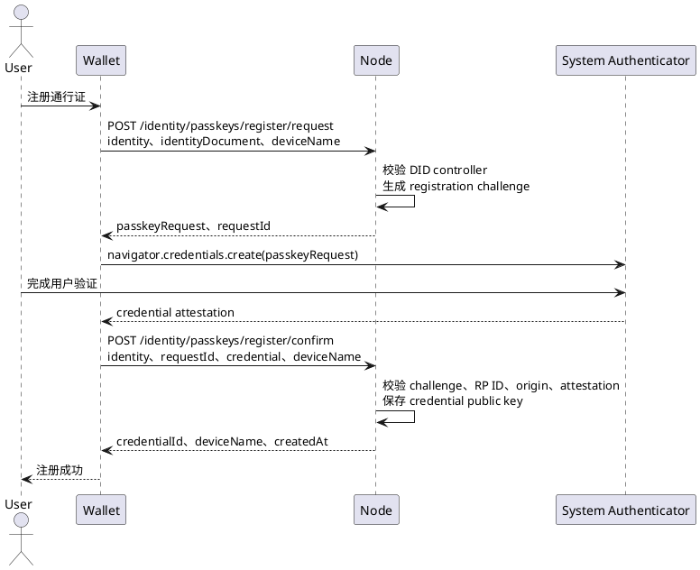

# 通行证接入

通行证是绑定到 Wallet Identity DID 的 Passkey/WebAuthn 认证器。它证明用户控制一个已经登记的系统认证器，用于没有 Wallet Provider 时登录同一个钱包身份。

通行证不是 DID、钱包账户或新的登录身份，也不授予交易签名、`eth_accounts` 或 UCAN 能力。DApp 必须以 Wallet Identity DID 作为用户主键。

## 1. 接入边界

| 参与方 | 职责 |
| --- | --- |
| Wallet | 在身份设置中注册、列出和撤销通行证 |
| Node | 作为 WebAuthn RP 保存公钥，校验 challenge、RP ID、origin、用户验证和签名 |
| 系统认证器 | 保存 Passkey 私钥，执行指纹、人脸、设备 PIN 或跨设备确认 |
| DApp 后端 | 创建 Wallet Identity 授权请求，保存 PKCE 和 state，兑换一次性授权码 |
| web3-bs | 说明接入契约；不把 Node HTTP 接口包装成钱包 Provider RPC |

Passkey 私钥始终留在系统认证器。Node 保存 credential ID、公钥、签名计数器、RP ID、传输方式和状态。

## 2. 注册流程

注册由 Wallet 身份设置页面发起。前置条件是 Wallet 已持有 Wallet Identity DID 和能够通过 `verifyIdentityController` 校验的身份文档。



### 2.1 创建注册请求

```http
POST {nodeBaseUrl}/api/v1/public/identity/passkeys/register/request
Content-Type: application/json
```

```json
{
  "identity": "did:yeying:wid_...",
  "identityDocument": {},
  "deviceName": "MacBook Touch ID"
}
```

成功响应的 `data.passkeyRequest` 是传给 `navigator.credentials.create()` 的 PublicKeyCredential creation options，其中 `requestId` 是本次 Node challenge ID。Wallet 必须保留该字段供确认接口使用。

Node 把同一 DID 下未撤销的 credential ID 写入 `excludeCredentials`。系统认证器选择已登记凭证时，浏览器会拒绝重复注册；Node 也会以 `IDENTITY_PASSKEY_DUPLICATE_CREDENTIAL` 拒绝重复 credential ID。

### 2.2 确认注册

Wallet 将 `navigator.credentials.create()` 的结果转换为可 JSON 序列化的 WebAuthn credential 后提交：

```http
POST {nodeBaseUrl}/api/v1/public/identity/passkeys/register/confirm
Content-Type: application/json
```

```json
{
  "identity": "did:yeying:wid_...",
  "requestId": "iwc_...",
  "credential": {},
  "deviceName": "MacBook Touch ID"
}
```

成功响应的 `data`：

```json
{
  "identity": "did:yeying:wid_...",
  "credentialId": "base64url-credential-id",
  "deviceName": "MacBook Touch ID",
  "createdAt": "2026-08-29T14:00:00.000Z"
}
```

注册 challenge 只能使用一次，并受 Node 配置的 challenge 有效期约束。

## 3. 查询和撤销

查询某个 DID 的全部通行证：

```http
POST {nodeBaseUrl}/api/v1/public/identity/passkeys/list
Content-Type: application/json

{"identity":"did:yeying:wid_..."}
```

每条记录包含 `credentialId`、`deviceName`、`rpId`、`transports`、`createdAt`、`lastUsedAt` 和 `revokedAt`。Wallet 应把未撤销记录显示为可用通行证，把撤销时间用于历史状态展示。

撤销指定通行证：

```http
POST {nodeBaseUrl}/api/v1/public/identity/passkeys/revoke
Content-Type: application/json
```

```json
{
  "identity": "did:yeying:wid_...",
  "identityDocument": {},
  "credentialId": "base64url-credential-id"
}
```

撤销必须校验身份 controller。撤销后 credential 立即失效，不能继续批准登录请求。

## 4. 使用通行证登录

DApp 不直接调用注册、列表和撤销接口。用户完成注册后，DApp 按 Wallet Identity authorization code + PKCE S256 流程打开 Node `verifyUrl`；Node 授权页调用 WebAuthn 并验证通行证，DApp 后端兑换授权码取得 DID 和获准凭证。

完整请求、页面流转、跨设备处理和错误码见[无插件身份登录接入](./无插件身份登录接入.md)。

## 5. 安全要求

- 生产环境必须使用 HTTPS；RP ID 和 origin 必须与 Node 配置精确匹配。
- 注册和认证必须要求用户验证，不能只检查用户存在。
- Wallet 不得保存 Passkey 私钥，也不得把 credential ID 当作身份主键。
- `identityDocument` 是注册和撤销的管理证明，不得由 DApp 代替用户生成。
- 一个 Wallet Identity DID 可以注册多个通行证；每个 credential ID 只能登记一次。
- 用户取消系统认证器操作时，本次操作结束，不自动切换到 SIWE 或其他登录协议。

## 6. 验收标准

1. 同一 DID 可以注册两个不同 credential ID，并分别显示设备名称。
2. 重复选择已登记 credential 时，注册明确失败且不产生新记录。
3. 修改 challenge、origin 或 RP ID 后，确认注册或登录失败。
4. 撤销一个通行证不影响同一 DID 下其他未撤销通行证。
5. 撤销后的 credential 不能完成无插件身份登录。
6. 插件登录和通行证登录返回同一个 Wallet Identity DID。
